###Setup dev environment for Nordic nRF9160DK and Thingy91

1. download nRF Connect for Desktop
   https://www.nordicsemi.com/Software-and-tools/Development-Tools/nRF-Connect-for-desktop
   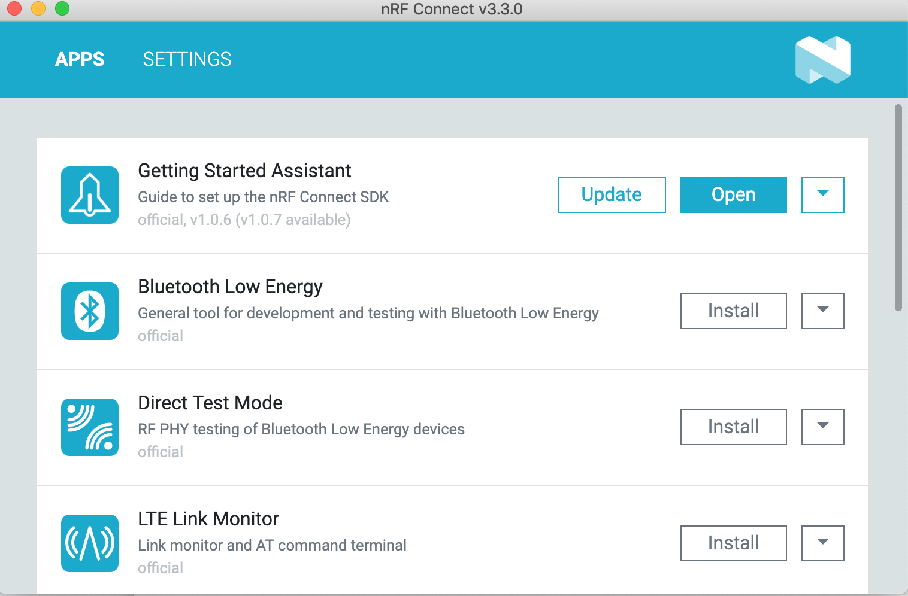

2. Open "Getting Started Assistant" and follow the instructions
   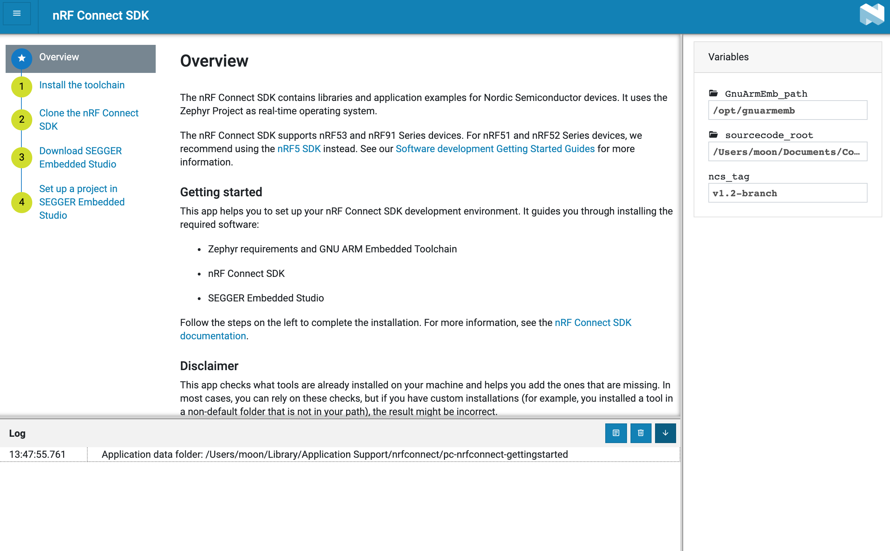

3. if fail to download SEGGER Embedded Studio (Nordic Edition) in Step 3, use the EmbeddedStudio in USB drive.

   Follow the Step 4 in "Getting Started Assistant".
   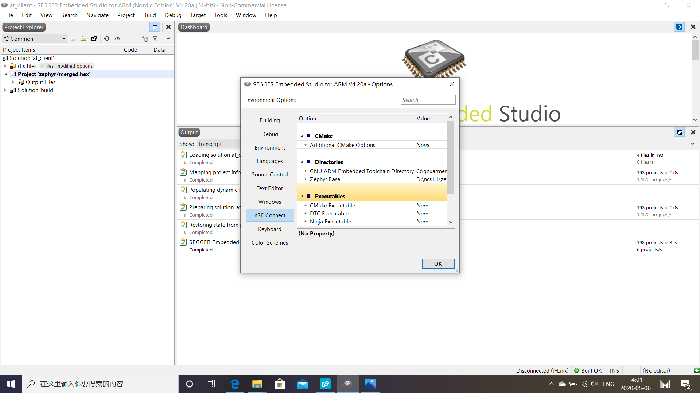

   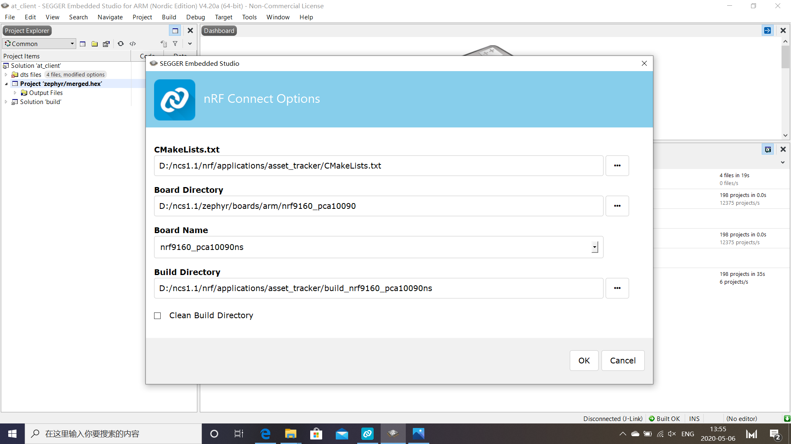

4. Connect nRF9160DK with USB

5. Build => Build zephyr/merged.hex
   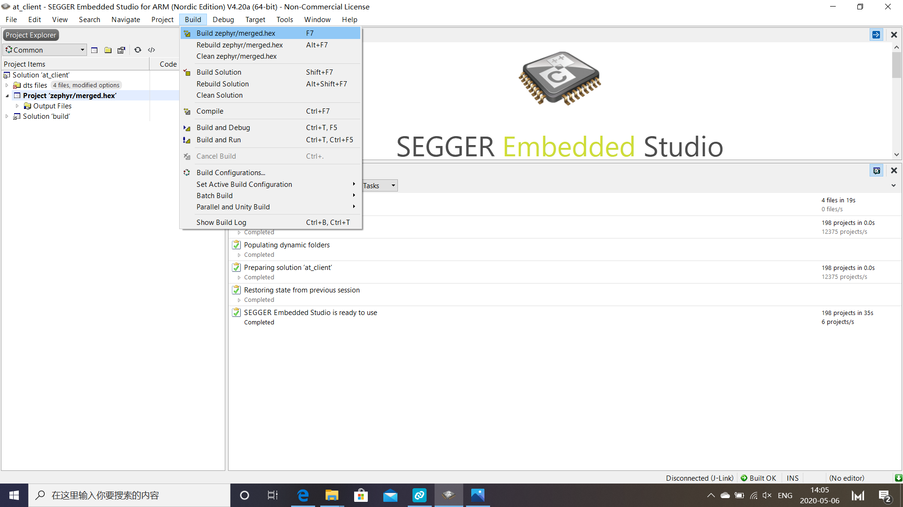

6. Download zephyr/merged.hex => nRF9160DK
   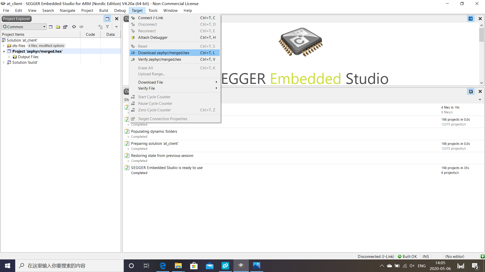

7. in nRF Connect Desktop SDK, open LTE Link Monitor

   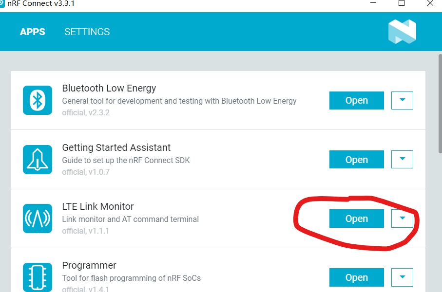

   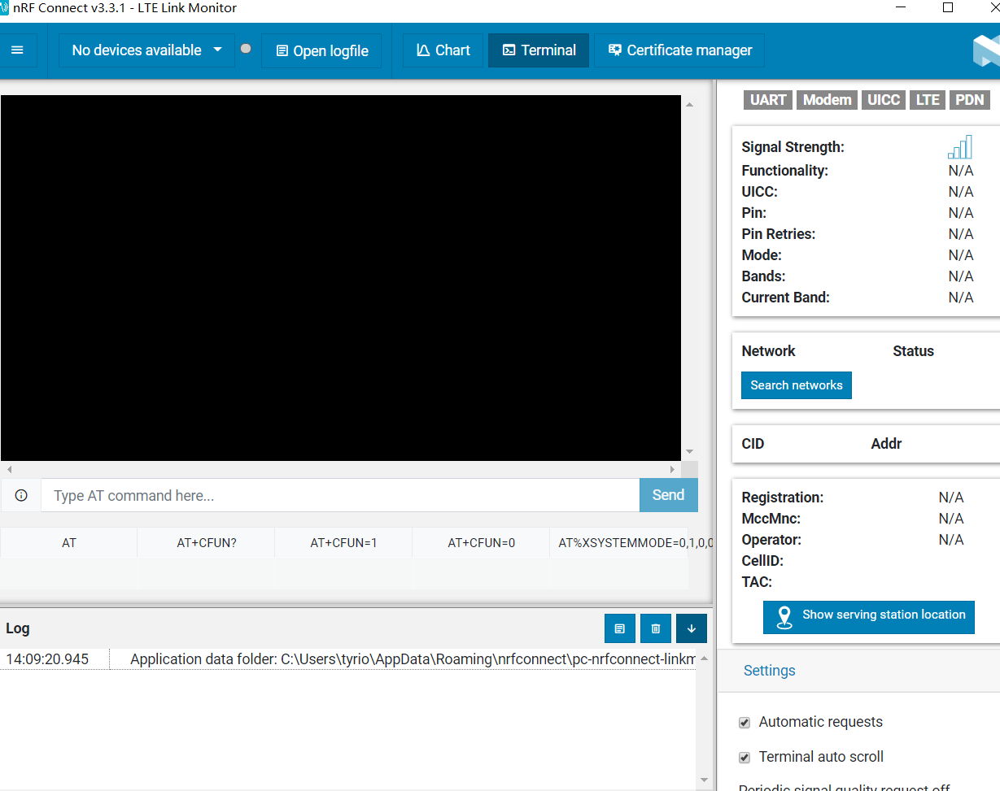

8. Choose connected devices

9. type AT commands

   ```
   AT+CFUN=0                   # close modem
   AT%XSYSTEMMODE=0,1,0,0      # set mode to NB-IoT
   AT+CFUN=1                   # open modem
   ```

10. wait several minutes to be connected
    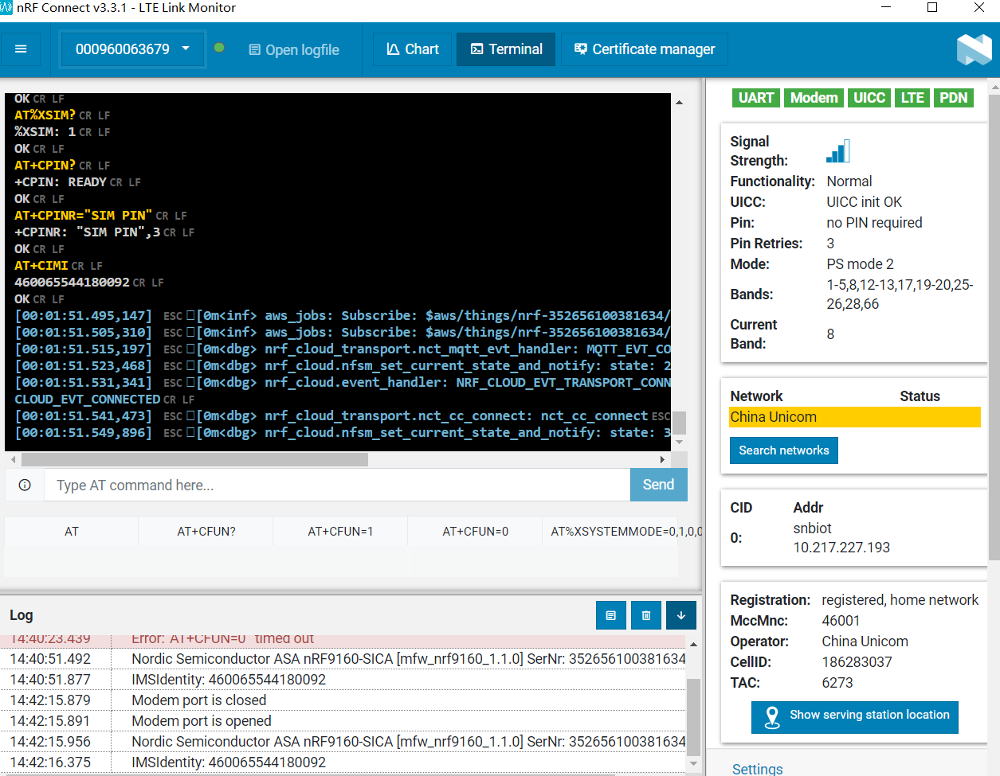

11. Setup Thingy91
    https://www.nordicsemi.com/Software-and-tools/Prototyping-platforms/Nordic-Thingy-91/GetStarted
    https://nrfcloud.com/

12. connect Thingy91 to computer via nRF9160

13. download the built code to Thingy91 and repete the Steps 5-10

14. Add Thingy91 Device on nRF Cloud
    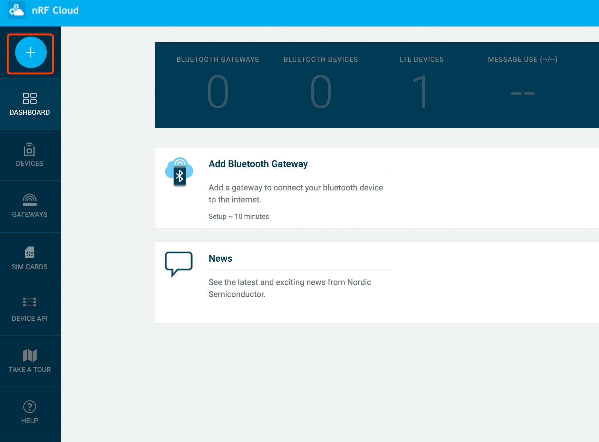
    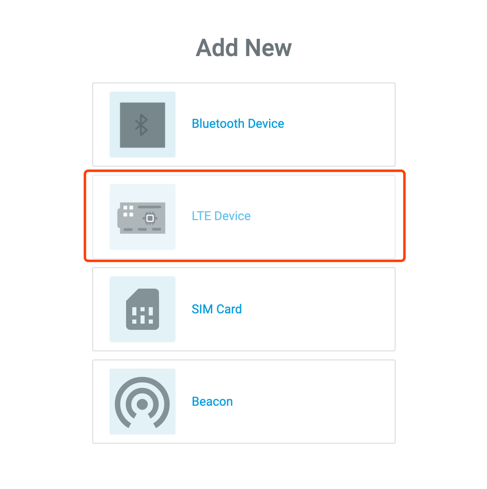
    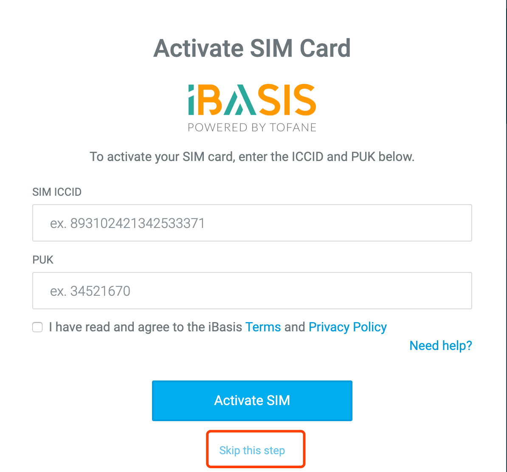
    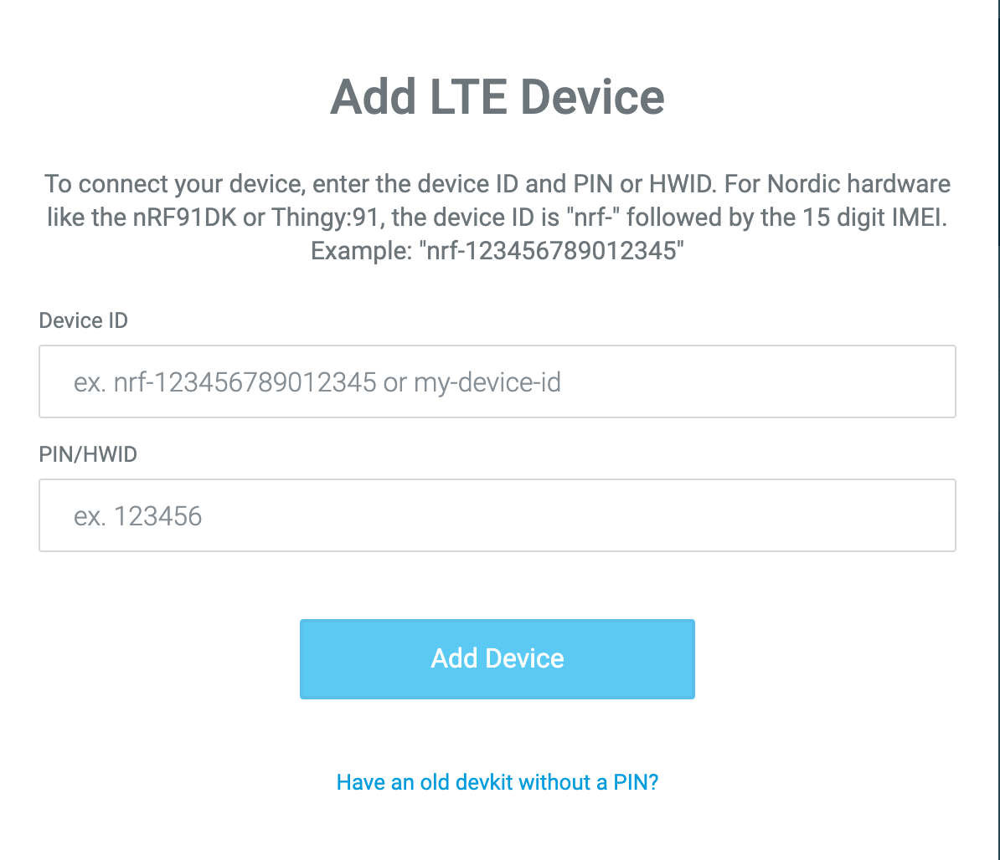

15. view device data
    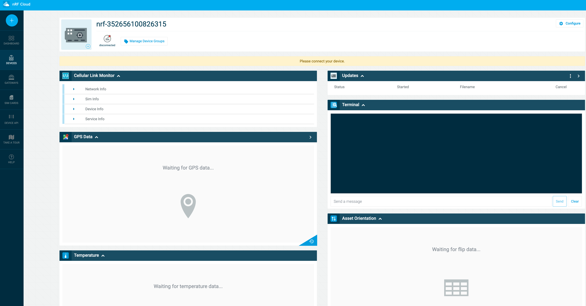